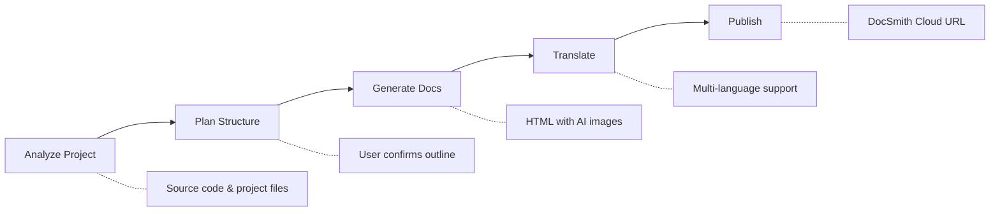

# DocSmith Skills

<p align="center">
  
</p>

<p align="center">
  
  
  
  
  <a href="https://github.com/AIGNE-io/doc-smith-skills/stargazers">
    
  </a>
</p>

<p align="center">
  English | <a href="./README.zh.md">中文</a>
</p>

<p align="center">
  <a href="https://docsmith.aigne.io">Official Site</a> · <a href="https://docsmith.aigne.io/en/showcase">Showcase</a> · <a href="https://github.com/AIGNE-io/doc-smith-skills/issues">Report Bug</a>
</p>

Turn your codebase into a polished documentation site with a single slash command — analyze, generate, translate, and publish, all inside your AI coding agent.

> **See it in action** — Browse real documentation sites generated by DocSmith: [Showcase](https://docsmith.aigne.io/en/showcase)

## Table of Contents

- [How it Works](#how-it-works)
- [Features](#features)
- [Prerequisites](#prerequisites)
- [Installation](#installation)
- [Quick Start](#quick-start)
- [Available Skills](#available-skills)
  - [doc-smith-create](#doc-smith-create)
  - [doc-smith-localize](#doc-smith-localize)
  - [doc-smith-publish](#doc-smith-publish)
- [Workspace Structure](#workspace-structure)
- [FAQ](#faq)
- [Contributing](#contributing)
- [License](#license)

## How it Works



## Features

| Feature | Description |
|---------|-------------|
| **Smart Analysis** | Scans source code, README, configs to understand your project |
| **Structured Planning** | Generates document outline for user review before writing |
| **HTML Generation** | Produces clean, navigable HTML documentation |
| **AI Images** | Auto-generates diagrams, flowcharts, and architecture charts |
| **Multi-language** | Translates docs to any language with terminology consistency |
| **Incremental Updates** | Hash-based change detection — only re-translates what changed |
| **One-click Publish** | Deploy to DocSmith Cloud and get a shareable preview URL |

## Prerequisites

- An AI coding agent that supports Skills — [Claude Code](https://claude.com/claude-code), [Cursor](https://cursor.sh), [Codex](https://openai.com/codex), [Gemini CLI](https://github.com/google-gemini/gemini-cli), or [35+ more](https://github.com/vercel-labs/skills#supported-agents)
- [Node.js](https://nodejs.org) >= 18

## Installation

```bash
npx skills add AIGNE-io/doc-smith-skills
```

> Powered by [skills](https://github.com/vercel-labs/skills) — the universal skill format for AI coding agents.

Or simply tell your AI coding agent:

> Please install Skills from github.com/AIGNE-io/doc-smith-skills

<details>
<summary><b>Via Claude Code Plugin Marketplace</b></summary>

```bash
# Register marketplace
/plugin marketplace add AIGNE-io/doc-smith-skills

# Install plugin
/plugin install doc-smith@doc-smith-skills
```

</details>

## Use with OpenClaw

Publish your documentation via OpenClaw:

1. Visit [DocSmith OpenClaw page](https://docsmith.aigne.io/openclaw)
2. Sign in and click "Generate Publish Prompt"
3. Copy the prompt and paste it into OpenClaw

The prompt includes skill installation, credential setup, and publish instructions — OpenClaw handles the rest. The credential is saved automatically and persists across sessions.

## Quick Start

**Step 1** — Generate documentation:

```bash
/doc-smith-create Generate English documentation for the current project
```

DocSmith will analyze your project, then present a document outline for you to review and confirm.
After your confirmation, it generates full HTML documentation with AI images in `.aigne/doc-smith/dist/`.

**Step 2** — Translate to other languages (optional):

```bash
/doc-smith-localize Translate docs to Japanese and Chinese
/doc-smith-localize --lang ja --lang zh
```

Only changed documents are re-translated. Use `--force` to translate everything.

**Step 3** — Publish online:

```bash
/doc-smith-publish
```

Uploads your docs to DocSmith Cloud and returns a shareable URL.

## Available Skills

| Skill | Description |
|-------|-------------|
| [doc-smith-create](#doc-smith-create) | Generate structured documentation from project sources |
| [doc-smith-localize](#doc-smith-localize) | Translate documents to multiple languages |
| [doc-smith-publish](#doc-smith-publish) | Publish to DocSmith Cloud for online preview |

Internal skills (called automatically, not invoked directly):

| Skill | Description |
|-------|-------------|
| doc-smith-build | Build Markdown into static HTML |
| doc-smith-check | Validate document structure and content integrity |
| doc-smith-images | Generate AI images (diagrams, flowcharts, architecture) |

---

### doc-smith-create

Generate comprehensive documentation from code repositories, text files, and media resources.

```bash
/doc-smith-create Generate English documentation for the current project
/doc-smith-create 为当前项目生成中文文档
```

<details>
<summary><b>Features & Details</b></summary>

- Analyzes source code and project structure
- Infers user intent and target audience
- Plans document structure with user confirmation
- Generates organized documentation with HTML output
- AI-generated images for diagrams and architecture charts
- Supports technical docs, user guides, API references, and tutorials

</details>

---

### doc-smith-localize

Translate documents to multiple languages with batch processing and terminology consistency.

```bash
/doc-smith-localize Translate docs to English
/doc-smith-localize 把文档翻译成英文和日文
/doc-smith-localize --lang en --lang ja
```

<details>
<summary><b>Options</b></summary>

| Option | Description |
|--------|-------------|
| `--lang <code>` | Target language code (repeatable) |
| `--path <path>` | Translate specific document only |
| `--force` | Force re-translate all documents |

</details>

<details>
<summary><b>Features & Details</b></summary>

- HTML-to-HTML translation (no intermediate Markdown step)
- Batch translation with progress tracking
- Terminology consistency across documents
- Image text translation support
- Incremental translation with hash-based change detection

</details>

---

### doc-smith-publish

Publish generated documents to DocSmith Cloud for online preview.

```bash
/doc-smith-publish
```

<details>
<summary><b>Options</b></summary>

| Option | Description |
|--------|-------------|
| `--dir <path>` | Publish specific directory (default: `.aigne/doc-smith/dist`) |
| `--hub <url>` | Custom hub URL |

</details>

<details>
<summary><b>Features & Details</b></summary>

- One-click publish to DocSmith Cloud
- Automatic asset upload and optimization
- Returns online preview URL

</details>

## Workspace Structure

DocSmith creates a workspace in `.aigne/doc-smith/` with its own git repository:

<details>
<summary><b>View directory layout</b></summary>

```
my-project/
├── .aigne/
│   └── doc-smith/                     # DocSmith workspace (independent git repo)
│       ├── config.yaml                # Workspace configuration
│       ├── intent/
│       │   └── user-intent.md         # User intent description
│       ├── planning/
│       │   └── document-structure.yaml # Document structure plan
│       ├── docs/                      # Document metadata
│       ├── dist/                      # Built HTML output
│       │   ├── zh/                    # Chinese docs
│       │   ├── en/                    # English docs
│       │   └── assets/               # Styles, scripts, images
│       ├── assets/                    # Generated image assets
│       └── cache/                     # Temporary data (not in git)
```

</details>

## FAQ

<details>
<summary><b>What project types does DocSmith support?</b></summary>

DocSmith works with any project — it analyzes source code, configuration files, README, and other project files regardless of language or framework.

</details>

<details>
<summary><b>Where is the workspace located?</b></summary>

All DocSmith data lives in `.aigne/doc-smith/` under your project root. It uses its own git repository, so it won't interfere with your project's version control.

</details>

<details>
<summary><b>How does incremental translation work?</b></summary>

DocSmith uses content hashing to detect changes. When you run `/doc-smith-localize`, only documents that have changed since the last translation will be re-translated. Use `--force` to override this behavior.

</details>

<details>
<summary><b>Can I customize the output theme?</b></summary>

Yes. DocSmith generates a `theme.css` file in the dist assets directory. You can modify it to customize colors, fonts, and layout.

</details>

## Contributing

Contributions are welcome! Please feel free to submit a [Pull Request](https://github.com/AIGNE-io/doc-smith-skills/pulls).

## Support

- [GitHub Issues](https://github.com/AIGNE-io/doc-smith-skills/issues) — Bug reports and feature requests
- [Official Site](https://docsmith.aigne.io) — Documentation and showcase
- [ArcBlock](https://www.arcblock.io) — Learn more about ArcBlock

## Author

**ArcBlock** - [blocklet@arcblock.io](mailto:blocklet@arcblock.io)

GitHub: [@ArcBlock](https://github.com/ArcBlock)

## License

[Apache-2.0](./LICENSE)
