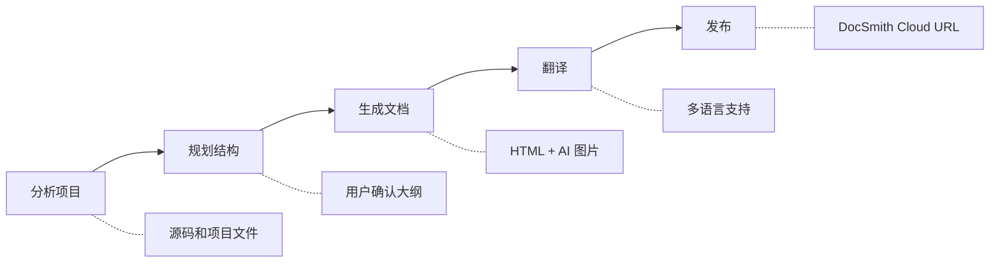

# DocSmith Skills

<p align="center">
  
</p>

<p align="center">
  
  
  
  
  <a href="https://github.com/AIGNE-io/doc-smith-skills/stargazers">
    
  </a>
</p>

<p align="center">
  <a href="./README.md">English</a> | 中文
</p>

<p align="center">
  <a href="https://docsmith.aigne.io">官方网站</a> · <a href="https://docsmith.aigne.io/en/showcase">案例展示</a> · <a href="https://github.com/AIGNE-io/doc-smith-skills/issues">报告问题</a>
</p>

一条斜杠命令，将代码仓库变成精美文档站 — 分析、生成、翻译、发布，全在 AI 编程助手中完成。

> **看看实际效果** — 浏览 DocSmith 生成的真实文档站点：[案例展示](https://docsmith.aigne.io/en/showcase)

## 目录

- [工作流程](#工作流程)
- [核心能力](#核心能力)
- [环境要求](#环境要求)
- [安装](#安装)
- [快速开始](#快速开始)
- [可用 Skills](#可用-skills)
  - [doc-smith-create](#doc-smith-create)
  - [doc-smith-localize](#doc-smith-localize)
  - [doc-smith-publish](#doc-smith-publish)
- [Workspace 目录结构](#workspace-目录结构)
- [常见问题](#常见问题)
- [贡献](#贡献)
- [许可](#许可)

## 工作流程



## 核心能力

| 能力 | 说明 |
|------|------|
| **智能分析** | 扫描源码、README、配置文件，理解项目全貌 |
| **结构规划** | 生成文档大纲，用户确认后再开始写作 |
| **HTML 生成** | 输出清晰、可导航的 HTML 文档 |
| **AI 图片** | 自动生成图表、流程图、架构图 |
| **多语言** | 翻译文档到任意语言，保持术语一致性 |
| **增量更新** | 基于 hash 的变更检测 — 只重新翻译有变化的内容 |
| **一键发布** | 部署到 DocSmith Cloud，获取可分享的预览链接 |

## 环境要求

- 支持 Skills 的 AI 编程助手 — [Claude Code](https://claude.com/claude-code)、[Cursor](https://cursor.sh)、[Codex](https://openai.com/codex)、[Gemini CLI](https://github.com/google-gemini/gemini-cli) 或 [35+ 更多](https://github.com/vercel-labs/skills#supported-agents)
- [Node.js](https://nodejs.org) >= 18

## 安装

```bash
npx skills add AIGNE-io/doc-smith-skills
```

> 基于 [skills](https://github.com/vercel-labs/skills) — AI 编程助手的通用技能格式。

或者直接告诉你的 AI 编程助手：

> 请从 github.com/AIGNE-io/doc-smith-skills 安装 Skills

<details>
<summary><b>通过 Claude Code 插件市场安装</b></summary>

```bash
# 注册市场
/plugin marketplace add AIGNE-io/doc-smith-skills

# 安装插件
/plugin install doc-smith@doc-smith-skills
```

</details>

## 快速开始

**第 1 步** — 生成文档：

```bash
/doc-smith-create 为当前项目生成中文文档
```

DocSmith 会分析项目，然后展示文档大纲供你确认。
确认后，它会在 `.aigne/doc-smith/dist/` 目录中生成完整的 HTML 文档和 AI 图片。

**第 2 步** — 翻译到其他语言（可选）：

```bash
/doc-smith-localize 把文档翻译成英文和日文
/doc-smith-localize --lang en --lang ja
```

只有变更过的文档会被重新翻译。使用 `--force` 强制全量翻译。

**第 3 步** — 发布上线：

```bash
/doc-smith-publish
```

将文档上传到 DocSmith Cloud，返回可分享的在线链接。

## 可用 Skills

| Skill | 说明 |
|-------|------|
| [doc-smith-create](#doc-smith-create) | 从项目源码生成结构化文档 |
| [doc-smith-localize](#doc-smith-localize) | 将文档翻译成多种语言 |
| [doc-smith-publish](#doc-smith-publish) | 发布到 DocSmith Cloud 在线预览 |

内部 Skills（自动调用，无需手动使用）：

| Skill | 说明 |
|-------|------|
| doc-smith-build | 将 Markdown 构建为静态 HTML |
| doc-smith-check | 验证文档结构和内容完整性 |
| doc-smith-images | 使用 AI 生成图片（图表、流程图、架构图） |

---

### doc-smith-create

从代码仓库、文本文件和媒体资源生成全面的文档。

```bash
/doc-smith-create 为当前项目生成中文文档
/doc-smith-create Generate English documentation for the current project
```

<details>
<summary><b>功能详情</b></summary>

- 分析源代码和项目结构
- 推断用户意图和目标受众
- 规划文档结构并与用户确认
- 生成组织良好的文档，输出为 HTML 格式
- AI 生成图片（图表、架构图等）
- 支持技术文档、用户指南、API 参考和教程

</details>

---

### doc-smith-localize

将文档翻译成多种语言，支持批量翻译和术语一致性。

```bash
/doc-smith-localize 把文档翻译成英文
/doc-smith-localize Translate docs to English and Japanese
/doc-smith-localize --lang en --lang ja
```

<details>
<summary><b>选项</b></summary>

| 选项 | 说明 |
|------|------|
| `--lang <code>` | 目标语言代码（可重复使用） |
| `--path <path>` | 仅翻译指定文档 |
| `--force` | 强制重新翻译所有文档 |

</details>

<details>
<summary><b>功能详情</b></summary>

- HTML 到 HTML 直接翻译（无中间 Markdown 步骤）
- 批量翻译，支持进度跟踪
- 跨文档术语一致性
- 图片文字翻译支持
- 基于 hash 的增量翻译（自动跳过未变更内容）

</details>

---

### doc-smith-publish

将生成的文档一键发布到 DocSmith Cloud。

```bash
/doc-smith-publish
```

<details>
<summary><b>选项</b></summary>

| 选项 | 说明 |
|------|------|
| `--dir <path>` | 指定发布目录（默认：`.aigne/doc-smith/dist`） |
| `--hub <url>` | 自定义 Hub URL |

</details>

<details>
<summary><b>功能详情</b></summary>

- 一键发布到 DocSmith Cloud
- 自动资源上传和优化
- 返回在线预览 URL

</details>

## Workspace 目录结构

DocSmith 在 `.aigne/doc-smith/` 目录创建独立的 workspace（含独立 git 仓库）：

<details>
<summary><b>查看目录结构</b></summary>

```
my-project/
├── .aigne/
│   └── doc-smith/                     # DocSmith workspace（独立 git 仓库）
│       ├── config.yaml                # Workspace 配置文件
│       ├── intent/
│       │   └── user-intent.md         # 用户意图描述
│       ├── planning/
│       │   └── document-structure.yaml # 文档结构计划
│       ├── docs/                      # 文档元数据
│       ├── dist/                      # 构建后的 HTML 输出
│       │   ├── zh/                    # 中文文档
│       │   ├── en/                    # 英文文档
│       │   └── assets/               # 样式、脚本、图片
│       ├── assets/                    # 生成的图片资源
│       └── cache/                     # 临时数据（不纳入 git）
```

</details>

## 常见问题

<details>
<summary><b>DocSmith 支持哪些项目类型？</b></summary>

DocSmith 适用于任何项目 — 它分析源代码、配置文件、README 和其他项目文件，不限编程语言或框架。

</details>

<details>
<summary><b>工作区在哪里？</b></summary>

所有 DocSmith 数据位于项目根目录的 `.aigne/doc-smith/` 中。它使用独立的 git 仓库，不会干扰你项目的版本控制。

</details>

<details>
<summary><b>增量翻译是怎么工作的？</b></summary>

DocSmith 使用内容 hash 检测变更。运行 `/doc-smith-localize` 时，只有自上次翻译后发生变化的文档才会被重新翻译。使用 `--force` 可以覆盖此行为。

</details>

<details>
<summary><b>可以自定义输出主题吗？</b></summary>

可以。DocSmith 在 dist assets 目录中生成 `theme.css` 文件，你可以修改它来自定义颜色、字体和布局。

</details>

## 贡献

欢迎贡献！请提交 [Pull Request](https://github.com/AIGNE-io/doc-smith-skills/pulls)。

## 支持

- [GitHub Issues](https://github.com/AIGNE-io/doc-smith-skills/issues) — Bug 报告和功能建议
- [官方网站](https://docsmith.aigne.io) — 文档和案例展示
- [ArcBlock](https://www.arcblock.io) — 了解更多关于 ArcBlock

## 作者

**ArcBlock** - [blocklet@arcblock.io](mailto:blocklet@arcblock.io)

GitHub: [@ArcBlock](https://github.com/ArcBlock)

## 许可

[Elastic-2.0](./LICENSE)
